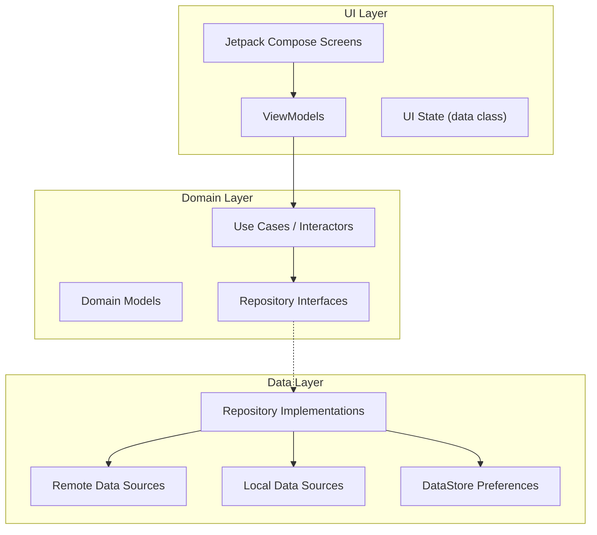
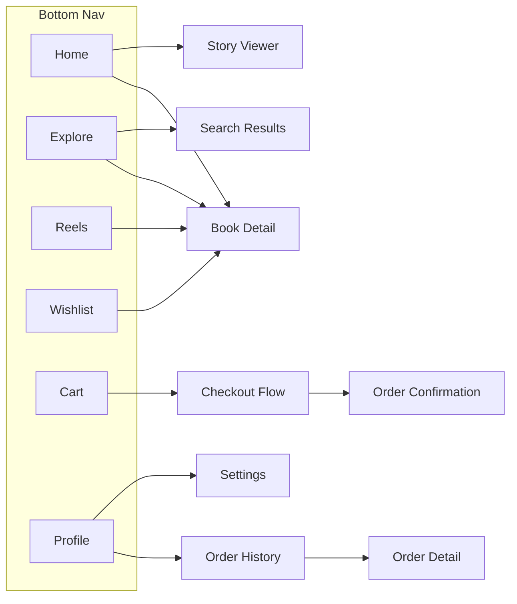
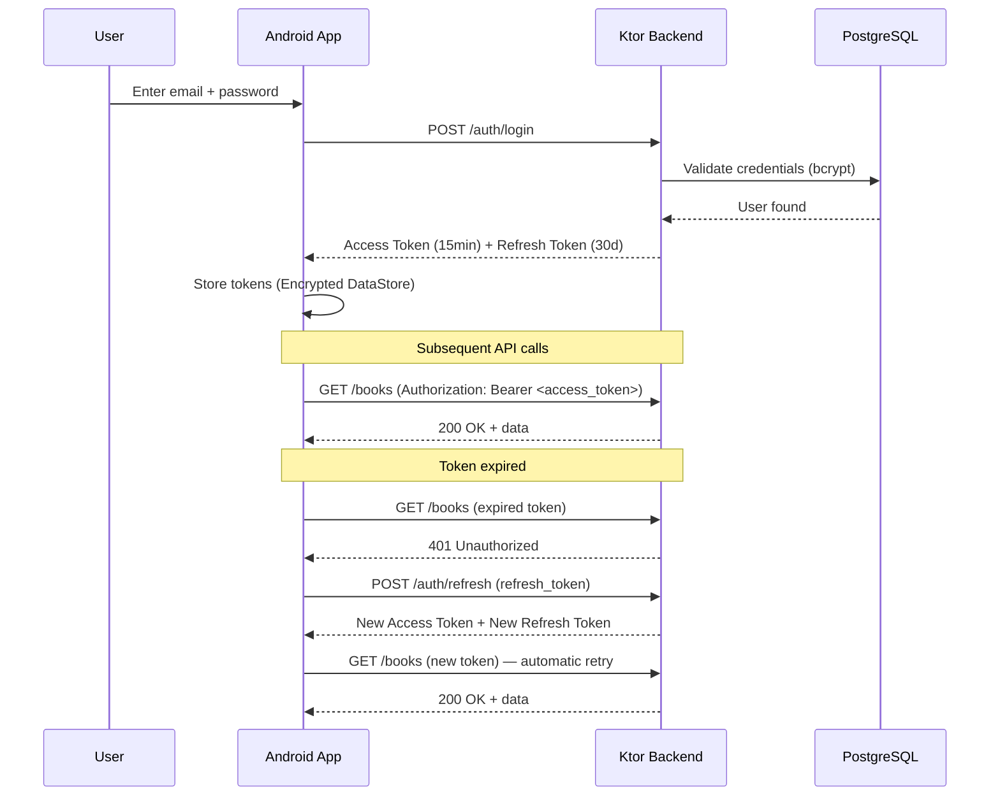
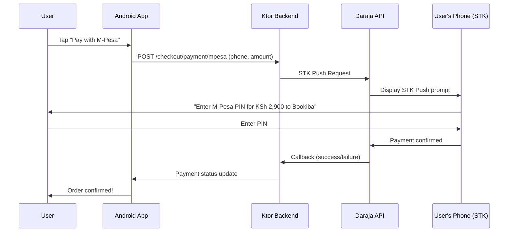
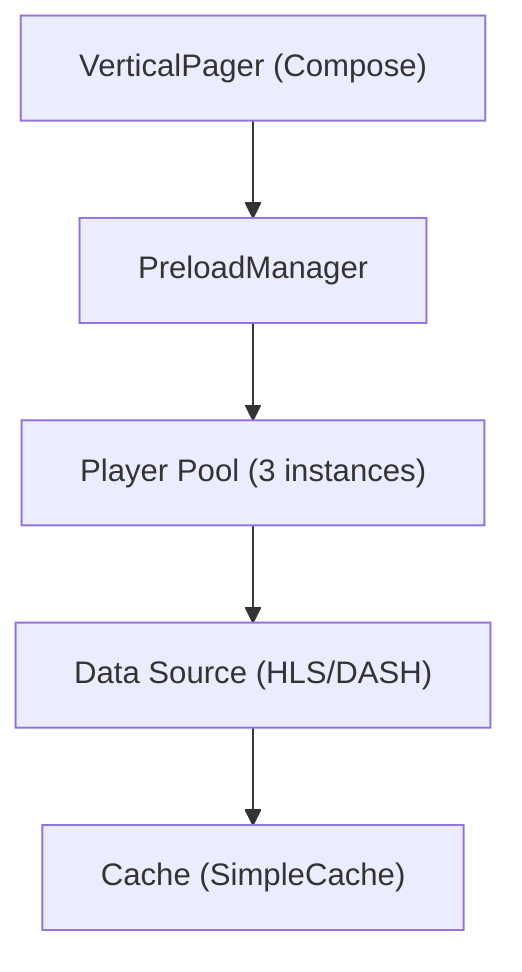

# Bookiba — Architecture Research Report

> **Date:** May 29, 2026
> **Scope:** Technology stack evaluation for a Kotlin-based curated book marketplace Android app
> **Constraint:** No Firebase (except minimal FCM for push notification transport)

---

## Table of Contents

1. [Architecture Pattern](#1-architecture-pattern)
2. [Local Database](#2-local-database)
3. [Networking](#3-networking)
4. [Dependency Injection](#4-dependency-injection)
5. [UI Framework](#5-ui-framework)
6. [Navigation](#6-navigation)
7. [Image Loading](#7-image-loading)
8. [Authentication](#8-authentication)
9. [Backend Server](#9-backend-server)
10. [Payment Integration](#10-payment-integration)
11. [Video / Reels](#11-video--reels)
12. [Push Notifications](#12-push-notifications)
13. [State Management](#13-state-management)
14. [Build System](#14-build-system)
15. [Testing](#15-testing)
16. [Final Recommended Stack](#16-final-recommended-stack)

---

## 1. Architecture Pattern

### ✅ Recommendation: Clean Architecture + MVVM (Hybrid with MVI Principles)

The Android industry has converged on a **modern, layered approach** prioritizing **Unidirectional Data Flow (UDF)** and **Clean Architecture** separation of concerns.

### Three-Layer Structure



| Layer | Responsibility | Android Dependencies |
|-------|---------------|---------------------|
| **UI Layer** | Screens, ViewModels, UI state | Compose, Hilt ViewModel |
| **Domain Layer** | Business logic, use cases, models | Pure Kotlin — **no Android dependencies** |
| **Data Layer** | API calls, DB access, caching | Room, Retrofit, DataStore |

### The Hybrid MVVM + MVI Approach (2026 Best Practice)

- Use **MVVM** as the base architecture — simpler, great Jetpack integration
- Adopt **MVI principles** within MVVM — consolidate UI state into a **single immutable data class** and use **sealed interfaces** for user actions/events
- Use `StateFlow` for state, `SharedFlow` or `Channel` for one-shot events

### When to use which

| Pattern | When to use | Example in Bookiba |
|---------|------------|-------------------|
| **Simple MVVM** | Screens with minimal interacting state | Profile, Settings, About |
| **MVVM + MVI state** | Complex screens with many state combinations | Cart, Checkout, Book Details |

### Example: ViewModel Pattern

```kotlin
// UI State — single immutable data class
data class CartUiState(
    val items: List<CartItem> = emptyList(),
    val subtotal: Long = 0,
    val shipping: Long = 0,
    val isLoading: Boolean = false,
    val error: String? = null
)

// User Events — sealed interface
sealed interface CartEvent {
    data class UpdateQuantity(val itemId: String, val quantity: Int) : CartEvent
    data class RemoveItem(val itemId: String) : CartEvent
    data class ApplyCoupon(val code: String) : CartEvent
    data object Checkout : CartEvent
}

// ViewModel
@HiltViewModel
class CartViewModel @Inject constructor(
    private val getCartUseCase: GetCartUseCase,
    private val updateCartUseCase: UpdateCartUseCase
) : ViewModel() {

    private val _state = MutableStateFlow(CartUiState())
    val state: StateFlow<CartUiState> = _state.asStateFlow()

    fun onEvent(event: CartEvent) { /* handle events */ }
}
```

> [!TIP]
> **For Bookiba specifically:** MVVM + Clean Architecture is the ideal foundation. For complex screens (cart/checkout with multiple interacting states), adopt MVI-style single state objects for predictable state management.

---

## 2. Local Database

### ✅ Recommendation: Room 3.0+

| Feature | Room 3.0+ | SQLDelight |
|---------|-----------|------------|
| **Approach** | Annotation-based (ORM-like) | SQL-first (schema-first) |
| **Learning Curve** | Low | Moderate (requires SQL fluency) |
| **KMP Support** | Yes (Android, iOS, JVM, JS, WasmJs) | Yes (Android, iOS, JVM, JS, Native) |
| **Flow Integration** | Native, seamless | Supported |
| **Google Backing** | ✅ Yes | JetBrains/Community |
| **Migration Support** | Built-in auto-migration | Manual |
| **Code Generation** | KSP (fast) | KSP |

### Why Room for Bookiba

- **Familiar annotations:** `@Entity`, `@Dao`, `@Database` — easy for any Android developer
- **Built-in reactive `Flow` support** — critical for offline-first book catalog
- **Robust migration management** — for evolving schemas as features grow
- **Excellent caching layer** — books, user data, cart, wishlist, reading progress
- **KSP code generation** — fast compilation

### Key Version

```
Room: 3.0+ (KMP-ready)
```

### Usage in Bookiba

| Data | Caching Strategy |
|------|-----------------|
| Book catalog | Cache with expiry, show stale while refreshing |
| Cart items | Full offline support, sync on reconnect |
| Wishlist | Offline read, optimistic local updates |
| User profile | Cache indefinitely, refresh on pull |
| Search history | Local-only, no sync |
| Order history | Cache, refresh on screen open |

---

## 3. Networking

### ✅ Recommendation: Retrofit + OkHttp + Kotlin Serialization

| Feature | Retrofit + OkHttp | Ktor Client |
|---------|-------------------|-------------|
| **Maturity** | Industry standard since 2013 | Modern, growing |
| **Learning Curve** | Low (annotation-based) | Moderate (DSL/plugin-based) |
| **KMP Support** | ❌ No (JVM only) | ✅ Yes |
| **Coroutines** | Supported | Native |
| **Interceptors** | OkHttp interceptors (powerful) | Plugins (flexible) |
| **Community** | Massive ecosystem | Smaller, growing |

### Why Retrofit for Bookiba

- **Battle-tested** for standard REST patterns (CRUD on books, orders, users)
- **OkHttp interceptors** for JWT token injection and automatic refresh
- **Massive ecosystem** — Chucker for debugging, Stetho, etc.
- **Pairs perfectly with Hilt** for DI

### Key Dependencies

```toml
[versions]
retrofit = "2.11.x"
okhttp = "4.12.x"
kotlinx-serialization = "1.7.x"

[libraries]
retrofit-core = { module = "com.squareup.retrofit2:retrofit", version.ref = "retrofit" }
okhttp-core = { module = "com.squareup.okhttp3:okhttp", version.ref = "okhttp" }
okhttp-logging = { module = "com.squareup.okhttp3:logging-interceptor", version.ref = "okhttp" }
kotlinx-serialization-json = { module = "org.jetbrains.kotlinx:kotlinx-serialization-json", version.ref = "kotlinx-serialization" }
```

> [!NOTE]
> **Kotlin Serialization** is preferred over Gson/Moshi in 2026 — it's Kotlin-native, multiplatform-ready, and integrates seamlessly with Ktor Server for shared DTOs.

---

## 4. Dependency Injection

### ✅ Recommendation: Hilt (Dagger-based)

| Feature | Hilt | Koin |
|---------|------|------|
| **Safety** | Compile-time (errors caught at build) | Runtime (errors may crash at runtime) |
| **Setup Complexity** | Steeper learning curve | Gentle (simple DSL) |
| **Performance** | Optimized runtime, slower builds | Slightly slower runtime, faster builds |
| **Jetpack Integration** | Seamless (ViewModel, Navigation, WorkManager) | Manual |
| **Google Recommended** | ✅ Yes | Community |

### Why Hilt for Bookiba

- **Compile-time validation** catches missing dependencies before release — critical for production e-commerce
- **Seamless integration** with ViewModel, Navigation Compose, WorkManager
- **Industry standard** for production Android apps
- **Google-maintained** and officially recommended

### Key Versions

```
Dagger/Hilt: 2.59.2
AndroidX Hilt extensions: 1.3.0
```

### Hilt Module Structure for Bookiba

```
di/
├── NetworkModule.kt       # Provides Retrofit, OkHttp, API services
├── DatabaseModule.kt      # Provides Room database, DAOs
├── RepositoryModule.kt    # Binds repository interfaces to implementations
├── DataStoreModule.kt     # Provides DataStore instances
└── AuthModule.kt          # Provides auth-related dependencies
```

---

## 5. UI Framework

### ✅ Recommendation: Jetpack Compose 1.11.2 + Material 3

Compose is now the **industry-standard, "Compose-First" UI toolkit**. Legacy View-based XML development is in maintenance mode.

### Key Best Practices for Bookiba

| Practice | Details |
|----------|---------|
| **Material 3** | Use `compose.material3` for all UI — Material 3 "Expressive" components are the latest |
| **Strong Skipping Mode** | Enabled by default — optimizes recomposition |
| **`remember` + `derivedStateOf`** | For performance on derived computations |
| **`collectAsStateWithLifecycle()`** | Safe Flow collection that respects lifecycle |
| **`LazyColumn`/`LazyRow` with stable keys** | For book lists, catalogs — prevents unnecessary recomposition |
| **Slot API pattern** | For reusable components (BookCard, SectionHeader) |
| **Side effects** | Use `LaunchedEffect`, `SideEffect`, `DisposableEffect` correctly |

### Key Versions

| Component | Version |
|-----------|---------|
| **Compose BOM** | Latest stable (2026.05.00) |
| **Kotlin** | 2.4.0 |
| **AGP** | 9.2.0 |
| **Compose Compiler** | Matched to Kotlin 2.4.0 |

### Compose-Specific Bookiba Considerations

- **Book grids** — `LazyVerticalGrid` with adaptive sizing for wishlist, explore
- **Horizontal scrolls** — `LazyRow` for "Found Today", "New Arrivals", story trays
- **Image galleries** — `HorizontalPager` for book detail images
- **Pull-to-refresh** — `PullToRefreshBox` (Material 3)
- **Bottom sheets** — `ModalBottomSheet` for filters, quick actions
- **Animations** — `AnimatedVisibility`, `animateContentSize`, `Crossfade` for micro-interactions

---

## 6. Navigation

### ✅ Recommendation: Jetpack Navigation Compose 2.8+ (Type-Safe Routes)

Since Navigation 2.8.0+, Jetpack Navigation uses **Kotlin Serialization** for type-safe navigation — no more error-prone string-based routes!

### Type-Safe Route Definitions

```kotlin
// Static destinations
@Serializable object Home
@Serializable object Explore
@Serializable object Reels
@Serializable object Wishlist
@Serializable object Cart
@Serializable object Profile

// Parameterized destinations
@Serializable data class BookDetail(val bookId: String)
@Serializable data class CategoryBooks(val categoryId: String, val categoryName: String)
@Serializable data class OrderDetail(val orderId: String)
@Serializable data class ReelViewer(val reelId: String)
```

### Best Practices

| Practice | Reason |
|----------|--------|
| Use `@Serializable object` for static screens | Type-safe, no args needed |
| Use `@Serializable data class` for parameterized screens | Compile-time checked arguments |
| Group routes in `sealed interface` hierarchies | Scalability, organization |
| **Never pass `NavController` to nested composables** | Use lambda callbacks instead |
| **Pass only IDs through navigation** | Fetch full data in destination ViewModel |

### Navigation Graph Structure



### Dependencies

```
androidx.navigation:navigation-compose:2.8.x+
org.jetbrains.kotlinx:kotlinx-serialization-json
+ Kotlin serialization Gradle plugin
```

---

## 7. Image Loading

### ✅ Recommendation: Coil 3

| Feature | Coil 3 | Glide |
|---------|--------|-------|
| **Language** | Kotlin-native | Java (with Kotlin extensions) |
| **Compose Integration** | First-class (`AsyncImage`) | Requires wrapper extensions |
| **Architecture** | Coroutines & Flow | Classic callback-based |
| **Library Size** | ~150 KB | ~400 KB+ |
| **KMP Support** | ✅ Yes | ❌ No |
| **Disk Caching** | Built-in | Built-in |

### Why Coil for Bookiba

- **Native Compose support** via `AsyncImage` composable — no wrappers needed
- **Kotlin-first** — coroutines for loading, Flows for observing
- **Perfect for book covers** — memory and disk caching, placeholder/error handling
- **Lightweight** — significantly smaller than Glide

### Key Version & Dependencies

```kotlin
// Latest: Coil 3 — 3.5.0-beta01 (May 2026)
implementation("io.coil-kt.coil3:coil-compose:3.5.0-beta01")
implementation("io.coil-kt.coil3:coil-network-okhttp:3.5.0-beta01")
```

### Usage Example

```kotlin
AsyncImage(
    model = ImageRequest.Builder(LocalContext.current)
        .data(book.coverUrl)
        .crossfade(300)
        .build(),
    contentDescription = book.title,
    modifier = Modifier
        .fillMaxWidth()
        .clip(RoundedCornerShape(12.dp)),
    contentScale = ContentScale.Crop,
    placeholder = painterResource(R.drawable.book_placeholder),
    error = painterResource(R.drawable.book_error)
)
```

---

## 8. Authentication

### ✅ Recommendation: JWT (Access Token + Refresh Token) with Secure Storage

### Authentication Flow



### Security Best Practices

| Practice | Details |
|----------|---------|
| **Never store tokens in plain SharedPreferences** | Use encrypted storage |
| **Use Android Keystore** | Hardware-backed TEE/StrongBox for crypto keys |
| **Short-lived access tokens** | 15-60 minutes maximum |
| **HTTPS only** | All communication encrypted in transit |
| **Server-side validation** | Validate JWT signature, `exp`, `iss`, `aud` |
| **No sensitive data in JWT payload** | Never store PII in token claims |
| **Use RS256 or ES256** | Asymmetric signing — never allow `none` algorithm |

### Implementation Components

| Component | Technology | Purpose |
|-----------|-----------|---------|
| Token Storage | Jetpack DataStore + Android Keystore (AES encryption) | Secure persistent storage |
| Token Injection | OkHttp `Interceptor` | Auto-add `Authorization: Bearer` header |
| Token Refresh | OkHttp `Authenticator` | Catch 401, refresh token, retry request |
| Password Hashing | bcrypt (server-side) | Secure credential storage |

---

## 9. Backend Server

### ✅ Recommendation: Ktor Server (All-Kotlin Stack)

| Feature | Ktor Server | Spring Boot |
|---------|-------------|-------------|
| **Philosophy** | Minimalist, plug-in what you need | Batteries-included |
| **Performance** | High (lighter, faster startup, lower memory) | Good (heavier footprint) |
| **Async Model** | Fully coroutine-based | Traditionally blocking (WebFlux for async) |
| **Kotlin Integration** | Kotlin-first (by JetBrains) | Excellent but inherits Java/Spring legacy |
| **Startup Time** | Fast (<1s) | Slower (2-5s) |
| **Memory** | ~50-100 MB | ~200-500 MB |
| **Ecosystem** | Smaller but growing | Massive enterprise ecosystem |

### Why Ktor for Bookiba

- **All-Kotlin stack** — share models/DTOs between Android app and backend
- **Lightweight and fast** — perfect for containerized/serverless deployment
- **Coroutine-native** — handles concurrent requests efficiently
- **Type-safe DSL** for routing — clean, readable API definitions
- **Built-in plugins** for JWT auth, content negotiation, CORS, WebSockets

### Key Version

```
Ktor Server: 3.5.0 (May 15, 2026)
```

### Essential Ktor Plugins

| Plugin | Purpose |
|--------|---------|
| `ktor-server-auth-jwt` | JWT authentication |
| `ktor-server-content-negotiation` | JSON serialization |
| `ktor-serialization-kotlinx-json` | Kotlin Serialization support |
| `ktor-server-cors` | CORS handling |
| `ktor-server-call-logging` | Request logging |
| `ktor-server-status-pages` | Error handling & status codes |
| `ktor-server-rate-limit` | Rate limiting |
| `ktor-server-websockets` | Real-time features |

### Database ORM: Exposed (by JetBrains)

- **Type-safe SQL DSL** — Kotlin-native query builder
- **DAO pattern** — object-oriented data access
- **Transaction support** — `transaction { }` blocks
- **PostgreSQL driver** — production-ready

---

## 10. Payment Integration

### ✅ Recommendation: M-Pesa (Daraja API) + Flutterwave

> [!IMPORTANT]
> **M-Pesa is the PRIMARY payment method in Kenya** — it should be displayed prominently above card payment options in the UI.

### M-Pesa Integration (Primary)

| Detail | Info |
|--------|------|
| **API** | Safaricom Daraja API (RESTful) |
| **Portal** | [developer.safaricom.co.ke](https://developer.safaricom.co.ke) |
| **Primary Method** | STK Push (Lipa na M-Pesa Online) — prompts user PIN on phone |
| **Environments** | Sandbox (testing) + Production |

### M-Pesa Payment Flow



> [!CAUTION]
> **CRITICAL:** Handle ALL payment API communication via your backend server. **Never expose Daraja Consumer Secret or API keys in the Android app code.**

### Card Payments (Secondary)

| Provider | Kenya Support | Features |
|----------|--------------|----------|
| **Flutterwave** ✅ | Full support | M-Pesa + Cards + USSD + Bank Transfer (all-in-one) |
| **Paystack** | Kenya supported | Excellent DX, Stripe-like API, owned by Stripe |
| **Stripe** ❌ | No direct Kenya merchant accounts | Use Paystack instead |

> [!TIP]
> **Flutterwave** is recommended because it supports M-Pesa AND card payments in a single integration, reducing complexity. You get one SDK for all payment methods.

### Implementation Rules

1. Backend handles ALL payment API communication
2. Android app only triggers payments via your own backend
3. Backend receives webhooks/callbacks for payment confirmation
4. **Never trust client-side payment confirmations alone** — always verify server-side

---

## 11. Video / Reels

### ✅ Recommendation: Jetpack Media3 (ExoPlayer) 1.10.1

### Dependencies

```kotlin
implementation("androidx.media3:media3-exoplayer:1.10.1")
implementation("androidx.media3:media3-ui:1.10.1")
implementation("androidx.media3:media3-ui-compose:1.10.1")  // Compose-native!
```

### Architecture for Short-Form Video (Reels)

| Component | Purpose |
|-----------|---------|
| **`VerticalPager`** (Compose) | Single-page lock behavior (TikTok/Reels scroll) |
| **`DefaultPreloadManager`** | Proactively preloads videos based on scroll proximity |
| **`PlayerSurface`** | Compose-native video rendering (from `media3-ui-compose`) |
| **Player pooling** | Reuse ExoPlayer instances instead of creating new ones per video |

### Best Practices

| Practice | Details |
|----------|---------|
| Use `settledPage` from `PagerState` | Trigger play/pause precisely on page transitions |
| Use DASH or HLS | Adaptive bitrate streaming (adjusts to network speed) |
| Release player in `onDispose` | Prevent memory leaks |
| Preload adjacent pages | Smooth scrolling experience |
| Mute by default | Match user expectations for social video feeds |
| Cache video segments | Reduce data usage on repeat views |

### Reels Feature Architecture



---

## 12. Push Notifications

### ✅ Recommendation: OneSignal (uses FCM under the hood)

> [!NOTE]
> **Important:** For apps on the Google Play Store, **FCM is mandatory** as the transport layer. There is no way to bypass this for standard Android distribution. The "no Firebase" constraint means we avoid Firebase Auth, Firestore, Analytics, etc. — but FCM for push transport is a necessary exception.

### How OneSignal Works

1. Create a **minimal Firebase project** ONLY for FCM credentials (Service Account JSON)
2. Upload credentials to OneSignal dashboard
3. OneSignal handles: delivery via FCM, segmentation, A/B testing, analytics, multi-channel

### You do NOT need

- Firebase Auth
- Firebase Analytics
- Firestore / Realtime Database
- Any other Firebase product

### Notification Types for Bookiba

| Notification | Trigger |
|-------------|---------|
| **Wishlist Alert** | "A book on your wishlist just dropped in price!" |
| **Rare Drop Alert** | "New rare edition just listed — only 1 copy!" |
| **Order Update** | "Your order #BN12345 has shipped!" |
| **Recommendation** | "Based on your taste: new Dark Academia arrivals" |
| **Promotion** | "Weekend sale: 15% off all vintage editions" |

### Alternative Providers

| Provider | Notes |
|----------|-------|
| **Airship** | Enterprise-grade, advanced segmentation |
| **Pushwoosh** | Self-hosted/on-premise option |
| **Amazon SNS** | If using AWS infrastructure |

### Self-Hosted Alternatives (Privacy-Focused)

| Provider | Type |
|----------|------|
| **UnifiedPush** | Open-source, decentralized |
| **ntfy** | Lightweight HTTP-based pub-sub |
| **Gotify** | Self-hosted via WebSockets |

---

## 13. State Management

### ✅ Recommendation: StateFlow (Not LiveData)

| Feature | StateFlow | LiveData |
|---------|-----------|----------|
| **Use Case** | Modern Kotlin/Compose apps | Legacy XML/View apps |
| **Lifecycle** | Use `collectAsStateWithLifecycle` | Built-in awareness |
| **Operators** | Full (map, combine, filter, debounce, etc.) | Very limited |
| **KMP Ready** | ✅ Yes | ❌ No (AndroidX only) |
| **Coroutine Support** | Native | Requires bridging |
| **Testing** | Turbine library | InstantTaskExecutorRule |

### State Patterns

| Pattern | When to Use | API |
|---------|------------|-----|
| **`StateFlow`** | Persistent UI state (loading, data, error) | `MutableStateFlow` + `.asStateFlow()` |
| **`SharedFlow`** | One-shot events (snackbar, navigation) | `MutableSharedFlow(replay = 0)` |
| **`Channel`** | Guaranteed delivery one-shot events | `Channel<Event>(Channel.BUFFERED)` |

### Best Practices

```kotlin
// ✅ CORRECT — Single immutable state class
data class HomeUiState(
    val featuredBooks: List<Book> = emptyList(),
    val staffPicks: List<Book> = emptyList(),
    val stories: List<Story> = emptyList(),
    val isLoading: Boolean = true,
    val error: String? = null
)

// ✅ CORRECT — Collect with lifecycle awareness
@Composable
fun HomeScreen(viewModel: HomeViewModel = hiltViewModel()) {
    val state by viewModel.state.collectAsStateWithLifecycle()
    // ... render UI based on state
}

// ❌ WRONG — Never use StateFlow for one-shot events
// StateFlow replays last value on config change → duplicate navigation/snackbar
```

> [!WARNING]
> **Never use `StateFlow` for one-shot events** (navigation, snackbars, toasts). It replays the last value on configuration change, causing duplicate actions. Use `Channel` or `SharedFlow` instead.

---

## 14. Build System

### ✅ Recommendation: Gradle Kotlin DSL + Version Catalogs + Convention Plugins

### Version Catalog (`libs.versions.toml`)

```toml
[versions]
kotlin = "2.4.0"
agp = "9.2.0"
compose-bom = "2026.05.00"
ktor = "3.5.0"
room = "3.0.0"
hilt = "2.59.2"
coil = "3.5.0-beta01"
media3 = "1.10.1"
navigation = "2.8.5"
retrofit = "2.11.0"
okhttp = "4.12.0"
kotlinx-serialization = "1.7.3"
exposed = "0.60.0"
postgresql = "42.7.4"

[libraries]
# Compose
compose-bom = { module = "androidx.compose:compose-bom", version.ref = "compose-bom" }
compose-ui = { module = "androidx.compose.ui:ui" }
compose-material3 = { module = "androidx.compose.material3:material3" }
compose-tooling = { module = "androidx.compose.ui:ui-tooling-preview" }
compose-activity = { module = "androidx.activity:activity-compose" }

# Navigation
navigation-compose = { module = "androidx.navigation:navigation-compose", version.ref = "navigation" }

# Hilt
hilt-android = { module = "com.google.dagger:hilt-android", version.ref = "hilt" }
hilt-compiler = { module = "com.google.dagger:hilt-compiler", version.ref = "hilt" }
hilt-navigation-compose = { module = "androidx.hilt:hilt-navigation-compose", version = "1.3.0" }

# Room
room-runtime = { module = "androidx.room:room-runtime", version.ref = "room" }
room-ktx = { module = "androidx.room:room-ktx", version.ref = "room" }
room-compiler = { module = "androidx.room:room-compiler", version.ref = "room" }

# Networking
retrofit-core = { module = "com.squareup.retrofit2:retrofit", version.ref = "retrofit" }
okhttp-core = { module = "com.squareup.okhttp3:okhttp", version.ref = "okhttp" }
okhttp-logging = { module = "com.squareup.okhttp3:logging-interceptor", version.ref = "okhttp" }

# Serialization
kotlinx-serialization-json = { module = "org.jetbrains.kotlinx:kotlinx-serialization-json", version.ref = "kotlinx-serialization" }

# Image Loading
coil-compose = { module = "io.coil-kt.coil3:coil-compose", version.ref = "coil" }
coil-network = { module = "io.coil-kt.coil3:coil-network-okhttp", version.ref = "coil" }

# Media
media3-exoplayer = { module = "androidx.media3:media3-exoplayer", version.ref = "media3" }
media3-ui = { module = "androidx.media3:media3-ui", version.ref = "media3" }
media3-ui-compose = { module = "androidx.media3:media3-ui-compose", version.ref = "media3" }

# Ktor Server
ktor-server-core = { module = "io.ktor:ktor-server-core", version.ref = "ktor" }
ktor-server-netty = { module = "io.ktor:ktor-server-netty", version.ref = "ktor" }
ktor-server-auth-jwt = { module = "io.ktor:ktor-server-auth-jwt", version.ref = "ktor" }
ktor-server-content-negotiation = { module = "io.ktor:ktor-server-content-negotiation", version.ref = "ktor" }
ktor-serialization-json = { module = "io.ktor:ktor-serialization-kotlinx-json", version.ref = "ktor" }

# Database (Server)
exposed-core = { module = "org.jetbrains.exposed:exposed-core", version.ref = "exposed" }
exposed-dao = { module = "org.jetbrains.exposed:exposed-dao", version.ref = "exposed" }
exposed-jdbc = { module = "org.jetbrains.exposed:exposed-jdbc", version.ref = "exposed" }
postgresql = { module = "org.postgresql:postgresql", version.ref = "postgresql" }

[bundles]
compose = ["compose-ui", "compose-material3", "compose-tooling", "compose-activity"]
room = ["room-runtime", "room-ktx"]
networking = ["retrofit-core", "okhttp-core", "okhttp-logging"]
media3 = ["media3-exoplayer", "media3-ui", "media3-ui-compose"]
ktor-server = ["ktor-server-core", "ktor-server-netty", "ktor-server-auth-jwt", "ktor-server-content-negotiation", "ktor-serialization-json"]
exposed = ["exposed-core", "exposed-dao", "exposed-jdbc", "postgresql"]

[plugins]
android-application = { id = "com.android.application", version.ref = "agp" }
android-library = { id = "com.android.library", version.ref = "agp" }
kotlin-android = { id = "org.jetbrains.kotlin.android", version.ref = "kotlin" }
kotlin-compose = { id = "org.jetbrains.kotlin.plugin.compose", version.ref = "kotlin" }
kotlin-serialization = { id = "org.jetbrains.kotlin.plugin.serialization", version.ref = "kotlin" }
hilt = { id = "com.google.dagger.hilt.android", version.ref = "hilt" }
ksp = { id = "com.google.devtools.ksp", version = "2.4.0-1.0.30" }
ktor = { id = "io.ktor.plugin", version.ref = "ktor" }
```

### Convention Plugins Pattern

```
build-logic/
└── convention/
    └── src/main/kotlin/
        ├── AndroidApplicationConventionPlugin.kt
        ├── AndroidLibraryConventionPlugin.kt
        ├── AndroidComposeConventionPlugin.kt
        ├── AndroidHiltConventionPlugin.kt
        └── AndroidFeatureConventionPlugin.kt
```

> [!TIP]
> Convention plugins eliminate copy-paste build configurations across feature modules. Each feature module just applies `id("bookiba.android.feature")` and gets Compose + Hilt + Navigation pre-configured.

---

## 15. Testing

### ✅ Recommendation: Layered Strategy (70-20-10 Rule)

| Layer | Coverage | Framework | What to Test |
|-------|----------|-----------|-------------|
| **Unit Tests** | 70% | JUnit 5 + MockK + Turbine | ViewModels, Use Cases, Repositories, Mappers |
| **Integration Tests** | 20% | JUnit 5 + Room in-memory DB | Repository + DB, API contracts |
| **UI / E2E Tests** | 10% | Compose Test + Maestro | Critical flows (checkout, login, cart) |

### Key Testing Libraries

| Library | Version | Purpose |
|---------|---------|---------|
| **JUnit 5** | 5.11.x | Modern test lifecycle (`@BeforeEach`, `@DisplayName`, `@Nested`) |
| **MockK** | 1.13.x | Kotlin-first mocking (preferred over Mockito in pure Kotlin) |
| **Turbine** | 1.2.x | Testing Kotlin `Flow` / `StateFlow` emissions |
| **kotlinx-coroutines-test** | Latest | `runTest`, `TestDispatcher` for async code |
| **Compose UI Test** | (BOM) | `createComposeRule`, semantic matchers |
| **Room in-memory DB** | (BOM) | DAO testing without real database |
| **Maestro** | Latest | YAML-based E2E testing, framework-agnostic |

### Testing Best Practices

| Practice | Details |
|----------|---------|
| **Naming** | `given_when_then` pattern for readability |
| **No `Thread.sleep()`** | Use `IdlingResource` or proper synchronization |
| **Page Object pattern** | For UI tests — encapsulate screen interactions |
| **Turbine for StateFlow** | Collect and assert state emissions in order |
| **TestDispatcher** | Always swap `Dispatchers.Main` with `TestDispatcher` in tests |
| **Fakes over Mocks** | Prefer fake implementations for repositories in tests |

### Example: ViewModel Test with Turbine

```kotlin
@Test
fun `given books exist, when home loads, then state shows books`() = runTest {
    // Given
    val books = listOf(Book("1", "The Hobbit"), Book("2", "1984"))
    coEvery { getBooksUseCase() } returns flowOf(books)

    // When
    val viewModel = HomeViewModel(getBooksUseCase)

    // Then
    viewModel.state.test {
        val state = awaitItem()
        assertThat(state.isLoading).isFalse()
        assertThat(state.featuredBooks).isEqualTo(books)
        cancelAndIgnoreRemainingEvents()
    }
}
```

---

## 16. Final Recommended Stack

| Category | Choice | Version |
|----------|--------|---------|
| **Language** | Kotlin | 2.4.0 |
| **Build** | AGP + Gradle Kotlin DSL + Version Catalogs | AGP 9.2.0 |
| **Architecture** | Clean Architecture + MVVM (hybrid MVI) | — |
| **UI** | Jetpack Compose + Material 3 | BOM 2026.05.00 |
| **Navigation** | Jetpack Navigation Compose (type-safe) | 2.8.5+ |
| **DI** | Hilt | 2.59.2 |
| **Database** | Room | 3.0+ |
| **Networking** | Retrofit + OkHttp | 2.11.x / 4.12.x |
| **Serialization** | Kotlinx Serialization | 1.7.x |
| **Image Loading** | Coil 3 | 3.5.0 |
| **State** | StateFlow + SharedFlow | (Kotlin Coroutines) |
| **Video** | Jetpack Media3 | 1.10.1 |
| **Auth** | JWT (Access + Refresh Token) | Custom |
| **Backend** | Ktor Server + Exposed ORM | 3.5.0 |
| **Database (Server)** | PostgreSQL | 16+ |
| **Payments** | M-Pesa (Daraja API) + Flutterwave | — |
| **Push Notifications** | OneSignal (FCM transport) | Latest SDK |
| **Testing** | JUnit 5 + MockK + Turbine + Compose Test + Maestro | — |

> [!TIP]
> This stack represents the most modern, production-ready choices for a Kotlin Android e-commerce app in 2025-2026, optimized specifically for the Kenyan market with M-Pesa as a first-class payment method.
